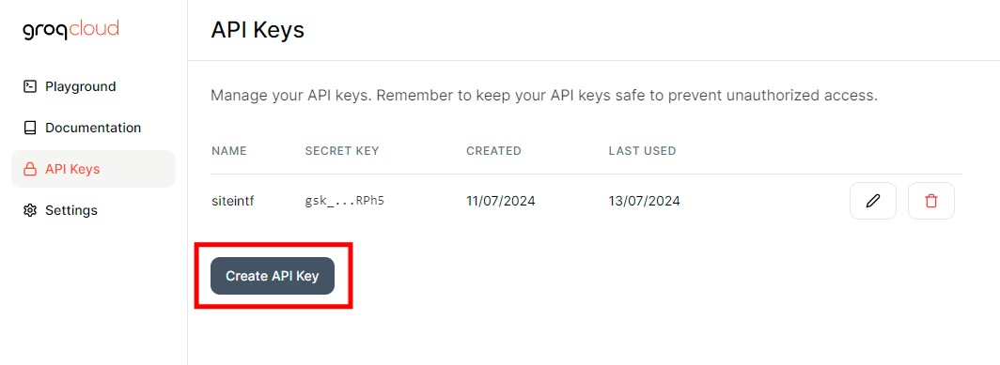
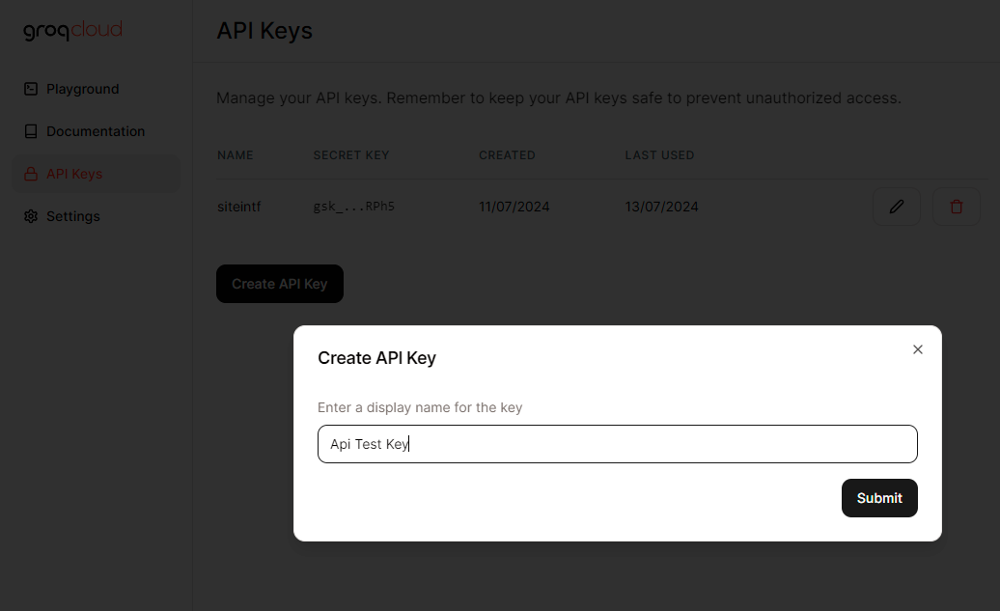
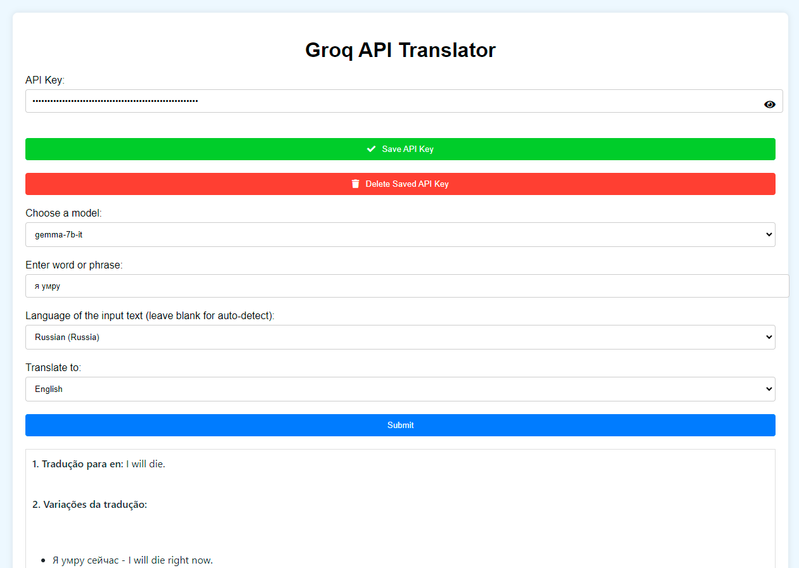
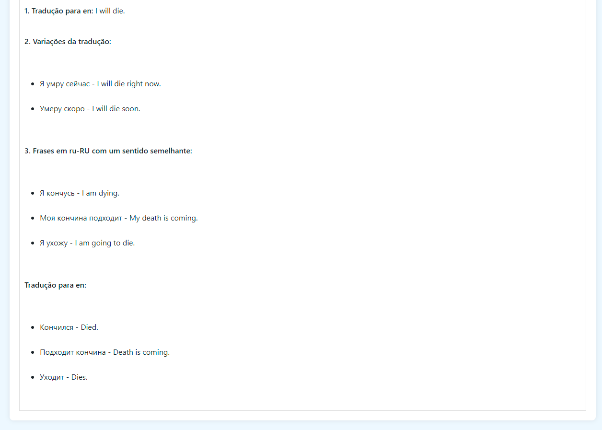
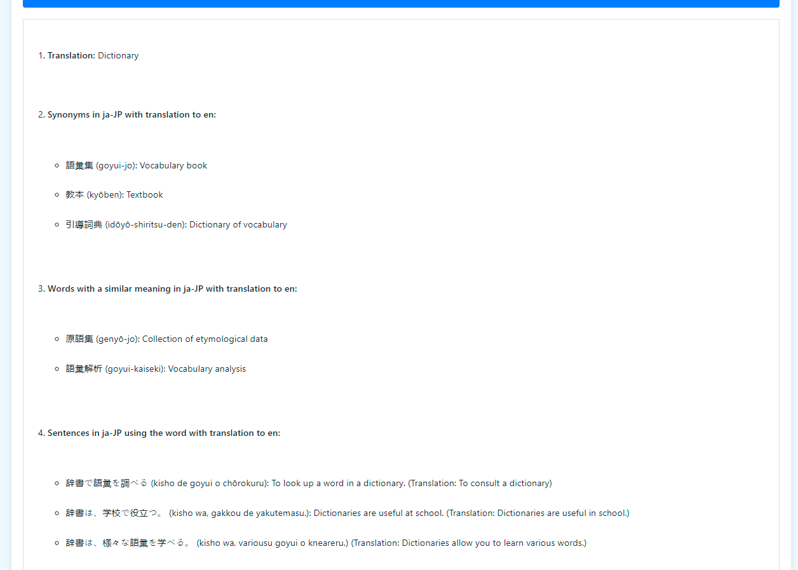
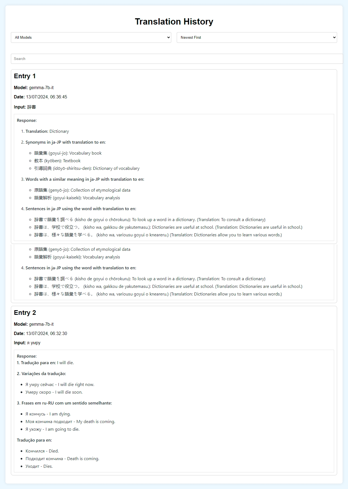

Claro! Aqui está uma versão aprimorada do seu README.md:

---

# Groq-Translate

Translate With AI

## [Português](Readme-pt.md) | [English](README.md)

### Autor: [e43b](https://github.com/e43b/)
### Repositório do projeto: [Groq-Translate](https://github.com/e43b/Groq-Translate)
### Doação: [Oxapay](https://oxapay.com/donate/40874860)
### Discord: [Groq-Translate Discord](https://discord.gg/bEyHhmbRVw)
### Link para o site: [Groq-Translate Website](https://e43b.github.io/Groq-Translate/)
### Gere sua Key: [Groq Console](https://console.groq.com/keys)

## Instruções para Uso

### 1. Criar Conta e Obter Chave da API

Primeiro, crie sua conta para obter uma chave da API da Groq:
[Groq Login](https://console.groq.com/login)

Após se cadastrar, acesse: [Obter Chave](https://console.groq.com/keys)

Aqui, você poderá criar uma nova chave API. Após isso, copie sua chave e clique em "done". É importante que você não compartilhe essa chave com ninguém, pois se alguém tiver acesso a ela, poderá usar sua chave resultando no uso do seu limite sem você saber.

### Tutorial para Criar Chave





### 2. Configuração no Site

Acessando o site [Groq-Translate](https://e43b.github.io/Groq-Translate/), você pode inserir sua chave de API e clicar no botão verde "Save API Key" para não precisar adicioná-la sempre que usar o site. Não se preocupe, o site não capturará essa informação. Caso você queira rodar o site na sua máquina, basta clonar o código da branch [gh-pages](https://github.com/e43b/Groq-Translate/tree/gh-pages).

Se você adicionou uma key e deseja excluí-la, basta clicar no botão vermelho com o texto "Delete Saved API Key".


### 3. Seleção de Modelos e Tradução

Selecione um dos 5 modelos diferentes que estão disponíveis atualmente. Cada um tem suas particularidades, então recomendamos que você teste para saber qual se sai melhor para o que você está traduzindo.

Para traduzir um texto, basta inserir a palavra ou frase que deseja traduzir, a língua original e a língua para a qual deseja traduzir os termos.

Se for uma frase, o modelo irá:
- Traduzir a frase
- Fornecer variações de traduções
- Sugerir frases com sentido semelhante

Lembre-se de que a resposta do modelo de IA pode variar bastante dependendo da frase e do modelo, por isso é importante testar.




Para palavras individuais, o modelo irá:
- Traduzir para a língua selecionada
- Fornecer sinônimos
- Sugerir palavras semelhantes
- Exibir exemplos de frases que usam a palavra




### 4. Histórico de Traduções

Acessando o link [Histórico de Traduções](https://e43b.github.io/Groq-Translate/#historico), você pode visualizar todas as suas traduções já feitas no site. É possível pesquisar por termos que você traduziu ou que foram respondidos pelo modelo, além de filtrar por traduções feitas com modelos específicos e organizar de mais novas para mais antigas ou vice-versa, permitindo ver traduções antigas/comparar modelos sem precisar fazer uma nova requisição.



### Contribuições e Modificações

Lembrando que este é um projeto open-source e incentivamos modificações. Uma das formas mais fáceis de contribuir é clonar o site através do repositório [gh-pages](https://github.com/e43b/Groq-Translate/tree/gh-pages).

#### Comando para clonar:
```bash
git clone -b gh-pages https://github.com/e43b/Groq-Translate.git
```

Modifique as partes específicas dos prompts no `script.js` para personalizar a resposta ou adicionar novos itens.


Apoio total é dado para forks e modificações a partir do nosso projeto inicial. Apenas pedimos crédito no projeto, linkando o autor [e43b](https://github.com/e43b/) e o repositório original [Groq-Translate](https://github.com/e43b/Groq-Translate/).

---

Espero que isso atenda às suas expectativas!
