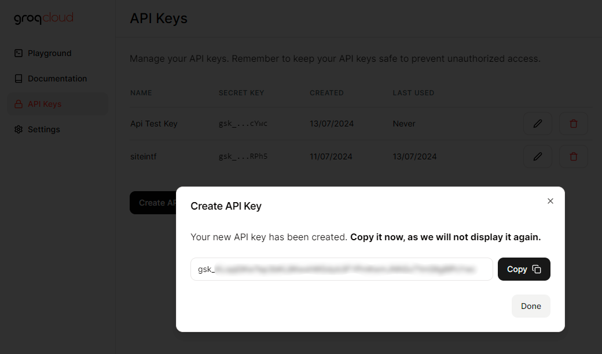

# Groq-Translate [](https://github.com/e43b/Groq-Translate/)

Groq-Translate é uma ferramenta de tradução baseada em inteligência artificial que oferece traduções precisas e versáteis para palavras e frases em diversos idiomas. Utilizando os avançados modelos de IA da Groq, o Groq-Translate não apenas traduz textos, mas também fornece sinônimos, variações de traduções e frases semelhantes, proporcionando uma compreensão mais ampla e contextual das traduções.

###### [ English](README.md) | [ Português](README-ptbr.md)

[](https://oxapay.com/donate/40874860)
[](https://discord.gg/CsBMMXBz7t)

**GitHub Project**: [DC Server Link Check](https://github.com/e43b/DC-Server-Link-Check/)  
**Autor**: [e43b](https://github.com/e43b)  
**Link para o site**: [Groq-Translate Website](https://e43b.github.io/Groq-Translate/)  
**Gere sua Key**: [Groq Console](https://console.groq.com/keys)

## Instruções para Uso

### 1. Criar Conta e Obter Chave da API

Primeiro, crie sua conta para obter uma chave da API da Groq: [Groq Login](https://console.groq.com/login)

Após se cadastrar, acesse: [Obter Chave](https://console.groq.com/keys)

Aqui, você poderá criar uma nova chave API. Após isso, copie sua chave e clique em "done". É importante que você não compartilhe essa chave com ninguém, pois se alguém tiver acesso a ela, poderá usar sua chave, resultando no uso do seu limite sem você saber.

### Tutorial para Criar Chave




### 2. Configuração no Site

Acesse o site [Groq-Translate](https://e43b.github.io/Groq-Translate/), insira sua chave de API e clique no botão verde "Save API Key" para não precisar adicioná-la sempre que usar o site. Não se preocupe, o site não capturará essa informação. Caso queira rodar o site na sua máquina, basta clonar o código da branch [gh-pages](https://github.com/e43b/Groq-Translate/tree/gh-pages).

Se você adicionou uma key e deseja excluí-la, basta clicar no botão vermelho com o texto "Delete Saved API Key".


### 3. Seleção de Modelos e Tradução

Selecione um dos cinco modelos diferentes que estão disponíveis atualmente. Cada um tem suas particularidades, então recomendamos que você teste para saber qual se sai melhor para o que você está traduzindo.

Para traduzir um texto, basta inserir a palavra ou frase que deseja traduzir, a língua original e a língua para a qual deseja traduzir os termos.

Se for uma frase, o modelo irá:
- Traduzir a frase
- Fornecer variações de traduções
- Sugerir frases com sentido semelhante

Lembre-se de que a resposta do modelo de IA pode variar bastante dependendo da frase e do modelo, por isso é importante testar.


Para palavras individuais, o modelo irá:
- Traduzir para a língua selecionada
- Fornecer sinônimos
- Sugerir palavras semelhantes
- Exibir exemplos de frases que usam a palavra


### 4. Histórico de Traduções

Acesse o link [Histórico de Traduções](https://e43b.github.io/Groq-Translate/#historico) para visualizar todas as suas traduções já feitas no site. É possível pesquisar por termos que você traduziu ou que foram respondidos pelo modelo, além de filtrar por traduções feitas com modelos específicos e organizar de mais novas para mais antigas ou vice-versa, permitindo ver traduções antigas e comparar modelos sem precisar fazer uma nova requisição.


### Contribuições e Modificações

Groq-Translate é um projeto open-source e incentivamos modificações. Uma das formas mais fáceis de contribuir é clonar o site através do repositório [gh-pages](https://github.com/e43b/Groq-Translate/tree/gh-pages).

#### Comando para clonar:
```bash
git clone -b gh-pages https://github.com/e43b/Groq-Translate.git
```

Modifique as partes específicas dos prompts no `script.js` para personalizar a resposta ou adicionar novos itens.


### Suporte

Se encontrar problemas ou dificuldades, acesse nosso [Discord](https://discord.gg/bEyHhmbRVw) e envie uma mensagem para obter suporte imediato da nossa equipe e da comunidade.

### Contribuição

Groq-Translate é um projeto open-source e acolhe contribuições da comunidade. Você pode clonar o repositório, fazer modificações e personalizar os prompts para adaptar a ferramenta às suas necessidades específicas. Para mais informações sobre como contribuir, visite nosso [repositório no GitHub](https://github.com/e43b/Groq-Translate).

Apoiamos totalmente forks e modificações baseadas em nosso projeto inicial. Apenas pedimos que você credite o autor [e43b](https://github.com/e43b/) e o repositório original [Groq-Translate](https://github.com/e43b/Groq-Translate) no seu novo projeto.
