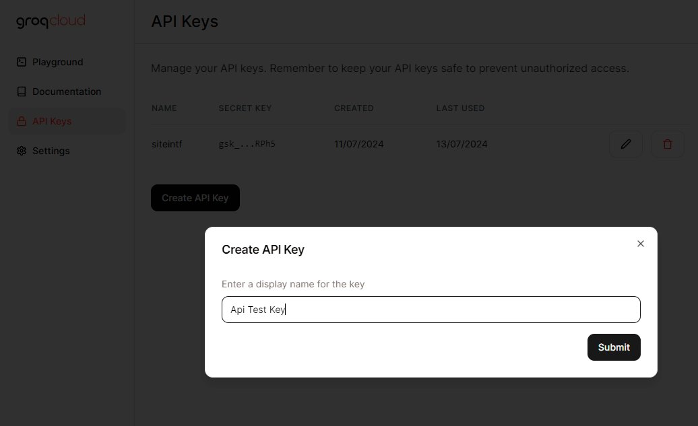
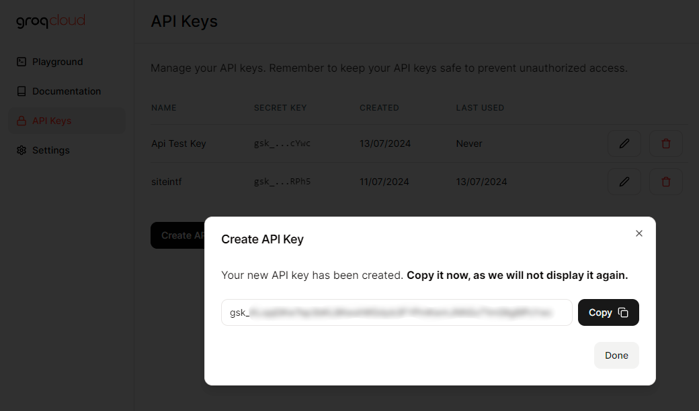
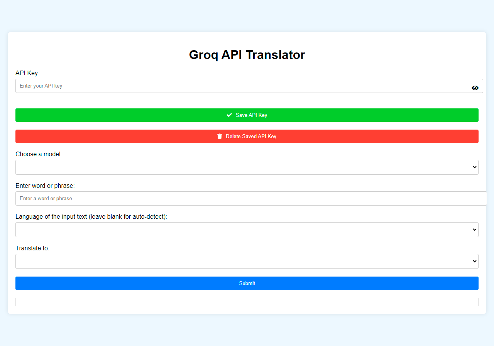
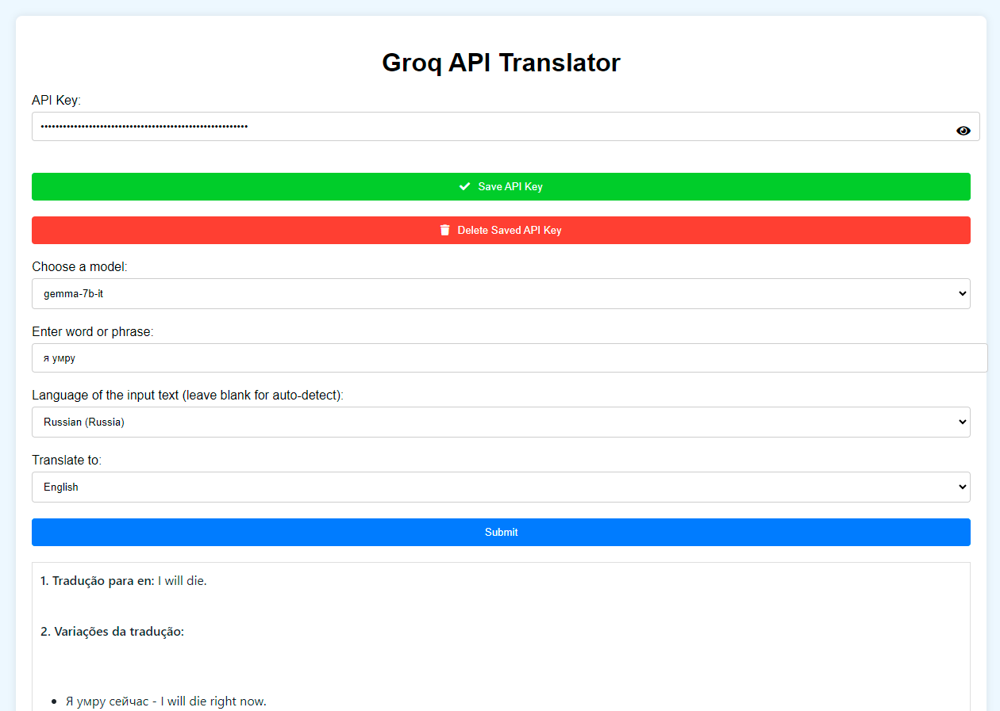
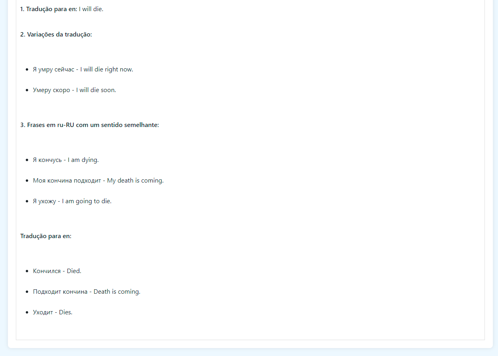
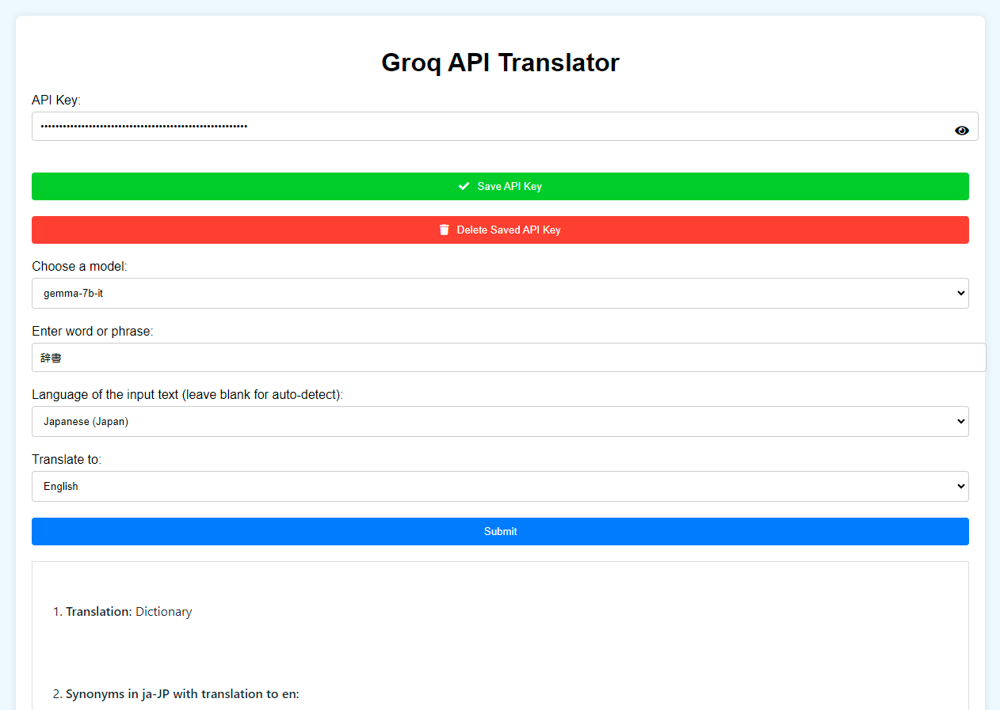
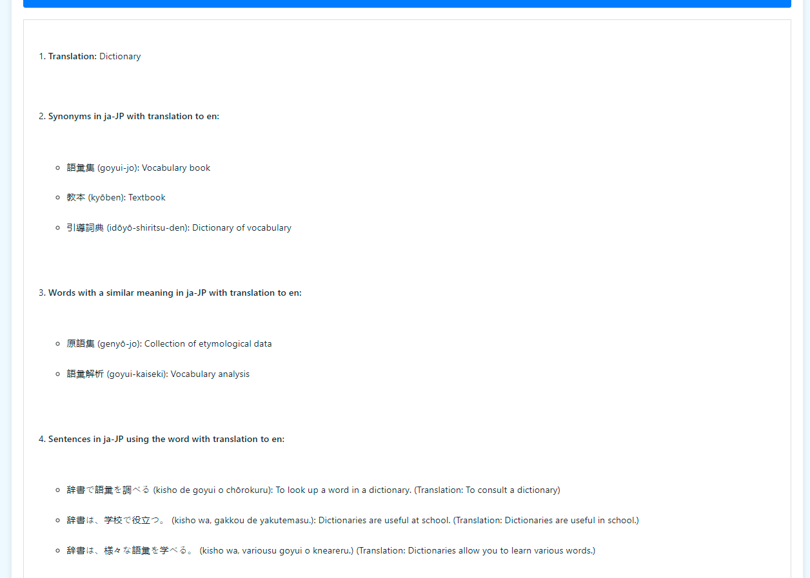
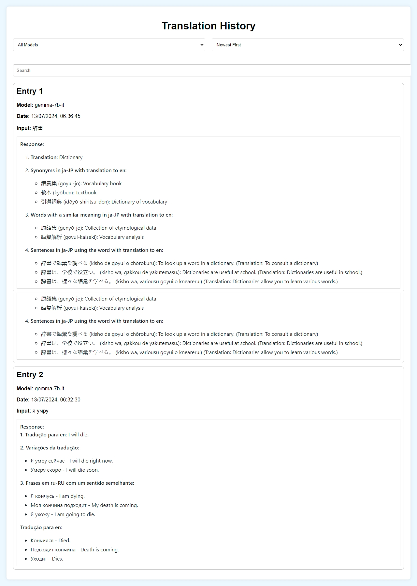
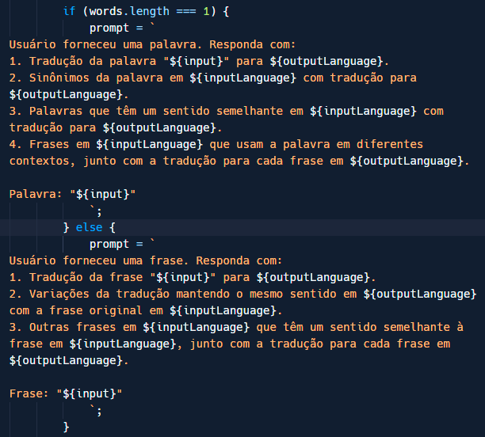

# Groq-Translate
Translate With AI

## [Português](Readme-pt.md) | [English](README.md)

Autor: https://github.com/e43b/
Respositório do projeto: https://github.com/e43b/Groq-Translate
Doação: https://oxapay.com/donate/40874860
Discord: https://discord.gg/bEyHhmbRVw
Link para o site: https://e43b.github.io/Groq-Translate/
Gere sua Key: https://console.groq.com/keys

primeiro crie sua conta para conseguir uma chave da API da groq https://console.groq.com/login

apos se cadastrqar acesse: https://console.groq.com/keys

aqui você ir criar uma nova chave api  apos isso copie sua chave e clique em "done" é importante que você não compartilhe ela com ninguem pois se alguém tiver acesso a ela vai poder usar a chve para o que quiser resultando no uso do seu limite sem você saber

### Tutorial Criar Chave

Acessando o site https://e43b.github.io/Groq-Translate/ voce colocará a sua chave de api e clicara no botão verde "Save API Key" caso não queira precisar adicionar ela sempre ao usar o site, não se preoculpe o site não ira capturar essa informação e caso você queira rodar ele na sua maquina basta clonar o codigo dessa branch aqui https://github.com/e43b/Groq-Translate/tree/gh-pages e caso você tenha colocado uma key e deseja excluir basta clicar no botão vermelhho com o texto "Delete Saved API Key"

Selecionara algum dos 5 modelos diferentes que estão disponivel atualmente cada um tem suas mudanças e peculiaridades recomendo que você teste para saber qual se sai melhor para o que você esta traduzindo

um input para o texto basta colocar a plavra ou a frase que deseja traduzir a lingua dessa palavra e a lingua que deseja traduzir os termos

se for uma frase ele vai traduzir ela, fornecer váriações de traduções para frase, frases com sentido selemhante, lembrando que  a responta do modelo de IA pode váriar bastante dependendo da frase e do modelo por isso é importante testar

no caso de palavras ele vai traduzir apra a lingua selecionada, fornecer sinonimos, palavras semelhantes e alguns exemplos de frases que usam a a palavra

Acessando o link https://e43b.github.io/Groq-Translate/#historico

pode visualizar todas as suas trafuções ja feitas no site podendo pesquisar por termos pesquisados por voce ou respondidos pelo, modelo também filtrar por traduções que foram feitas com modelos especificos também organizar de mais novas para mais antigas ou vice versa assim permitindo ver traduções antigas/comparar modelos sem precisar fazer fazer uma requisição de novo

Lembrando esse é om projeto opensourece e incentivamos modificaçãoes, provavelmentre uma das mais faceis seja clocar o site por meio daqui https://github.com/e43b/Groq-Translate/tree/gh-pages

Comando para clonar
`git clone -b gh-pages https://github.com/e43b/Groq-Translate.git`

e modificando essas partes de prompts em especificos

`script.js`

pode personalizr bastante seja como é fonecida a resposta para seja adionado novos intes modificando os existesntes e afins esse é um exemplo simples mas que funciona bem para seu proposito essa ideia pode ser modificado ou inclementada damos todo apoio a forkys e modificações a aprtir de nosso pojeto incial só peço um credito no projeto linkando o autor https://github.com/e43b/ e o respositorio original https://github.com/e43b/Groq-Translate/ no seu novo

